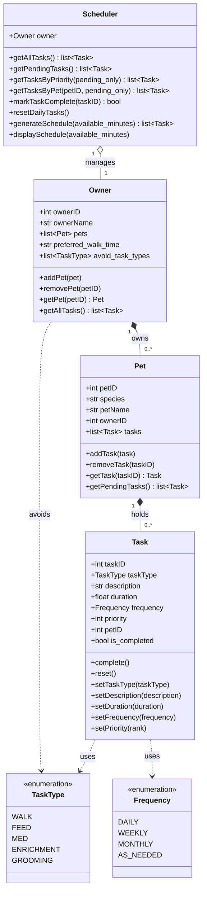

# PawPal System — UML Class Diagram

```mermaid
classDiagram

    %% ── Enumerations ──────────────────────────────────────────────

    class TaskType {
        <<enumeration>>
        WALK
        FEED
        MED
        ENRICHMENT
        GROOMING
    }

    class Frequency {
        <<enumeration>>
        DAILY
        WEEKLY
        MONTHLY
        AS_NEEDED
    }

    %% ── Core Classes ──────────────────────────────────────────────

    class Task {
        +int taskID
        +TaskType taskType
        +str description
        +float duration
        +Frequency frequency
        +int priority
        +int petID
        +bool is_completed
        +complete()
        +reset()
        +setTaskType(taskType)
        +setDescription(description)
        +setDuration(duration)
        +setFrequency(frequency)
        +setPriority(rank)
    }

    class Pet {
        +int petID
        +str species
        +str petName
        +int ownerID
        +list~Task~ tasks
        +addTask(task)
        +removeTask(taskID)
        +getTask(taskID) Task
        +getPendingTasks() list~Task~
    }

    class Owner {
        +int ownerID
        +str ownerName
        +list~Pet~ pets
        +str preferred_walk_time
        +list~TaskType~ avoid_task_types
        +addPet(pet)
        +removePet(petID)
        +getPet(petID) Pet
        +getAllTasks() list~Task~
    }

    class Scheduler {
        +Owner owner
        +getAllTasks() list~Task~
        +getPendingTasks() list~Task~
        +getTasksByPriority(pending_only) list~Task~
        +getTasksByPet(petID, pending_only) list~Task~
        +markTaskComplete(taskID) bool
        +resetDailyTasks()
        +generateSchedule(available_minutes) list~Task~
        +displaySchedule(available_minutes)
    }

    %% ── Relationships ─────────────────────────────────────────────

    %% Owner owns one or more Pets (composition)
    Owner "1" *-- "0..*" Pet : owns

    %% Pet holds one or more Tasks (composition)
    Pet "1" *-- "0..*" Task : holds

    %% Scheduler is bound to one Owner (aggregation)
    Scheduler "1" o-- "1" Owner : manages

    %% Task uses TaskType and Frequency (dependency)
    Task ..> TaskType : uses
    Task ..> Frequency : uses

    %% Owner references TaskType for its avoid list (dependency)
    Owner ..> TaskType : avoids
```
